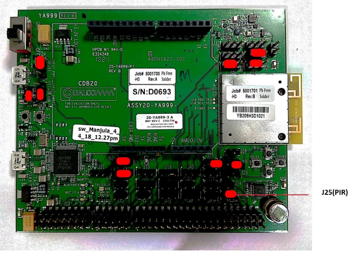

# Center Stage
This project is designed to use the proximity sensor on the QCA4020 development board to gauge crowd engagement at the center stage of a music festival. This sensor value can be used to change color patterns on BLE light bulbs to create an engaging atmosphere at the venue. The QCA4020 Development board is also programmed to interface with the DragonBoard™ 410c from Arrow Electronics which is designed to act as a smart gateway that runs a node.js based web application and notifies the event organizers when the crowd engagement drops.

Below is the list of devices needed to setup this demo:
 - QCA4020 (Inbuilt PIR sensor)
 - DragonBoard™ 410c (Connected via Serial to QCA4020)
 - Playbulbs’s BLE Bulbs - 5 no.s (Connected via BLE)
 - Bluetooth Speaker
 - HDMI Display

QCA4020 automatically scans and connects to Playbulbs’s BLE Bulbs. This setup is to create lighting effect based on intensity of motion detected. Onboard (QCA4020) PIR sensor is used for motion detection. Motion data along with genre of music selected by visitors to the demo is posted to AWS through Dragon 410c board

# QCA 4020 Board Application Installation

## Pre-requisite
 - Playbulbs’s BLE Bulb must be named as “PIR-20-MSCD”. Can be done through playbulb's mobile app.
 - Setup the QCA402x sdk (Provided in this repo)
 - Setup the gcc-arm-none-eabi toolchain and proper environment variables, to compile the source
 - Python 2.7 or more has to be installed on windows system to flash the binary to QCA4020 device
 - Install the QDLoader in windows to setup the flashtool
 - Download Music_Demo Binary on the board
 - Draganboard 410c should be connected to Bluetooth speakers

## Application Installation
### QCA4020 Build
 - Go to the `QCA4020_sdk/target/quartz/demo/Music_Demo/build/gcc` from CMD/Terminal
 - For `Linux`, run below command to build the binary
```sh
user@user:~$ cd QCA4020_sdk/target/quartz/demo/build/gcc
user@user:gcc$ make prepare
user@user:gcc$ make
```
 - For `Windows`, run below command to build binary
```sh
C:/ cd /[path to application directory]/build/gcc
C:/[path to application directory]/build/gcc > build.bat
```
 - The above steps will generate the binary in `output` folder in `build/gcc` folder
 - Now add jumper to pin `J34(1,2)` for setting the board to the `flash mode`
 - Goto `output` directory on your console, and type below command in windows to flash the binary on the board,
```sh
C:/[path to application directory]/build/gcc/output > py -2 QCA402x_sdk/target/build/tools/flash/qflash.py –comm=<USB Port Number>
```
`NOTE: Command must be run inside build/gcc/output directory presents in Application directory.`

### DraganBoard 410c Setup
#### Install NodeJS
- Execute the following command in the command line to setup the NodeJS base version.
```sh
$ curl -sL https://deb.nodesource.com/setup_9.x | sudo -E bash – 
```
- Install NodeJS by executing the following command.
```
$> sudo apt-get install nodejs
```
- Install process manager module by executing the following command
```
$> npm install pm2 -g
```
#### Install Dependencies
- Run the setup script to install the dependencies. Please, find the script in the application’s root path. (~/Dragon_410c)
```
    $> cd /Dragon_410c/iiot-music-festival
    $> sudo npm i
    $> ./setup.sh
```
#### Adding Songs
Please, move to below mentioned folder path
```
cd /demo2/qca-iiot-music-festival/songs/
```
You will see 4 folders
```
1. edm
2. hiphop
3. pop
4. rock
```
Please, add n number of songs with mp3 format. The application will shuffle among the songs and it will play.

## Hardware Setup
### QCA4020 PIR Sensor
Jumper settings for PIR:



### BLE Bulb
Power on all the bulbs, and follow steps below to rename the BT name of bulbs to “PIR-20-MSCD”
- Install Playbulb mobile app (Android or IOS). 
 - Opening the app will list the bulbs.
 - Connect to each bulb and clicking on that bulb will move to next screen.
 - Click on settings icon (gear icon) to get to Product Rename. 
 - Enter “PIR-20-MSCD” and click “Rename Confirm”  button to change the name.
 - Repeat these steps for each of the 5 bulbs.

## Configuration Changes for Dragonboard-410c

Configuration information for this demo can be found here:
```sh
cd demo2/qca-iiot-music-festival/iiot-music-festival/config/config.json.
```
The file contains 3 parts
```
Configuratoin for Serial Communication
Configuration for AWS IOT Client
Configuration for Application database
```
```
{
        "SERIAL_COMM":{
                "serial_port":"/dev/ttyUSB1",
                "start_4020_app":"4 4 1",
                "start_music":"4 4 3",
                "stop_music": "4 4 2",
                "duration_in_sec" : "3",
                "frequency_threshold" : "3"
        },
        "AWS_IOT_CLIENT":{
                "host" : "a11hq9a0r6cqjs-ats.iot.eu-west-1.amazonaws.com",
                "rootCAPath" : "root-CA.crt",
                "certificatePath" : "QCA4020_MUSIC_FTV.cert.pem",
                "privateKeyPath" : "QCA4020_MUSIC_FTV.private.key",
                "clientId" : "QCA_Music_410c_Client",
                "topic" : "pir_timestamp",
                "mode" : "publish"
        },
        "APP_DB_CONFIG" :{
                "dbConfig" : {
                        "dialect": "sqlite3",
                        "schemaName": "music_festival",
                        "connection": {
                                "filename": "./demo2.db"
                        }
                },
                "port" : "8000"
        }
```
Please change the following appropriately:

- serial_port - usb port name on which QCA4020 is connected (to Dragonboard-410c).
- duration_in_sec – Single slot of time duration during which movements will be detected and counted
- frequency_threshold – Minimum number of movements within a single of slot of "duration_in_sec" that can be treated as fast movement. 

Note: Please restart Dragonboard-410c every time SERIAL_COMM configuration is changed.

## Start Web APP on Dragonboard-410c
 - Please navigate to the path mentioned below in cloned code
```
$ cd ~/Dragon_410c/qca-iiot-music-festival/iiot-music-festival/
```
- Execute the below command to start the application.
```
$ ./start.sh
```
- Use the command below for stopping and clean-up of the application.
```
$ ./stop.sh
```
Once this application is started please allow 3 minutes (maximum) for QCA4020 to scan and connect to all the bulbs. (Once connected, all the bulbs will blink in white colour every 5 seconds). QCA4020 automatically scans and connects to the bulbs (5 of them) in case of any disconnections.

## Music Data Dashboard

Use the URL below in the browser for viewing dashboard.
http://localhost:8000
